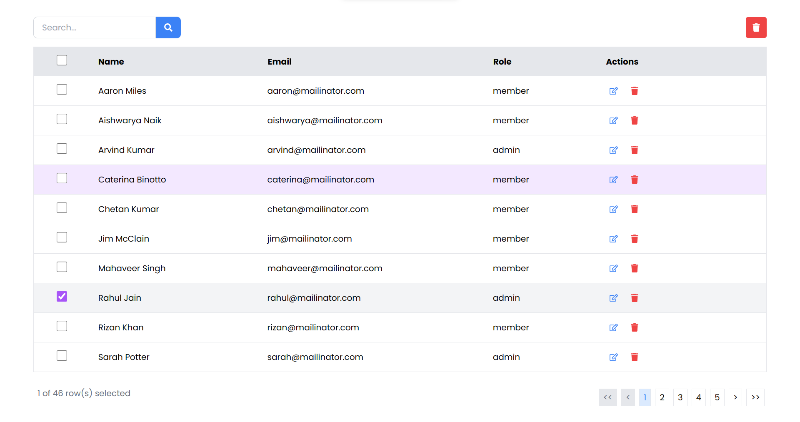
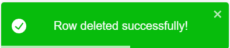

# About

This is an interface for admins to see and delete users. The users will be provided via an API. The sample API response is as follows -

```js
[
	{
	"id": "1",
	"name": "Aaron Miles",
	"email": "aaron@mailinator.com",
	"role": "member"
	},
	{
	"id": "2",
	"name": "Aishwarya Naik",
	"email": "aishwarya@mailinator.com",
	"role": "member"
	},
    ...
]

```

## Tech Stack

The technologies used in implementation of this user interface are -

1. React.Js
2. Tailwind CSS
3. Framer Motion

Other packages used are -

- axios
- react-icons
- react-toastify

# UI



You can check out the deployed site [here](https://admin-dashboard-dbgk.onrender.com)

# Features

Some terminologies used are

- `Data` -> Entire data fetched from API stored in this variable
- `SelectedRow` -> Variable that stores id's of all selected rows

### 1. Search Bar

The seach bar on the top handles searching/filtering on any type of property. The search can be triggered using the search icon on right of the search bar or by pressing the "Enter" key on the keyboard. The codebase for the same is seen in `components/SeachBar.jsx`

### 2. Edit Row

The `EditIcon` (pencil icon) in the right of each row will set the row to editing mode (This is visible by change in background color of the row). Now the user can either save the changes to row or cancel all the changes he made to the row.

### 3. Delete Row

The `DeleteIcon` (bin icon) besides the `EditIcon` will delete the row from the memory. All the changes are being performed in the memory itself. This removes the row from `data` itself.

### 4. Select Row

One or multiple rows can be selected/deselected by using the checkbox or clicking on the contents of the row on the leftmost column of each row. This is done by using a useState variable [selectedRows] in which rows are added/removed. Selected row is grayish in color.

### 5. Delete Selected Rows

The `DeleteIcon` in top right of the page is responsible for deletion of selected rows. This removes all the selected rows from the `data`.

### 6. Pagination

The pagination is performed by limiting the number of rows per page. According to requirement, only 10 rows are shown per page. This can be changed by updating `itemsPerPage` variable in `DataGrid.jsx`. Also, there are several buttons which can be used to control the navigation between pages. There are also special buttons for navigating to first page and last page.

## Other User Experience Features Added

### Added Toasts for feedback


<br>


### Added animations using framer motion

Transition was added and many more. You can checkout demo video [here](public/demo.mp4)

<video src="public/demo.mp4" controls title="Demonstration"></video>
